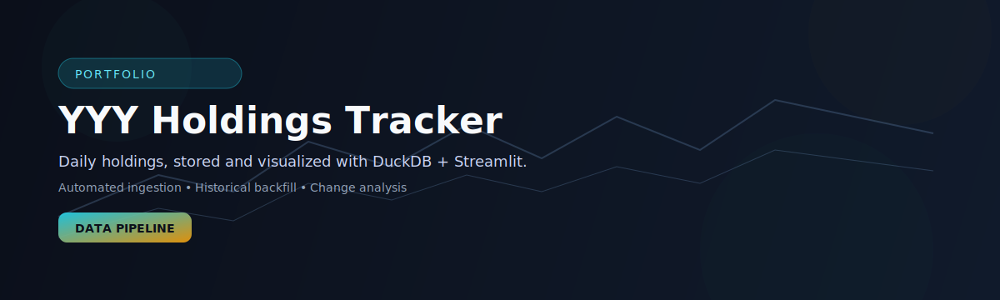
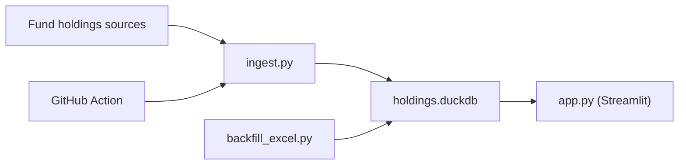

# ETF Holdings Tracker (YYY + PCEF)



[](https://github.com/ikgeorgiev/yyy_holdings/actions/workflows/daily_fetch.yml)
[](LICENSE)


Track, store, and visualize daily holdings for multiple ETFs (currently `YYY` and `PCEF`). This repo includes a scheduled ingestion job, a DuckDB data store, and a Streamlit dashboard to compare holdings across dates.

## At a Glance
- Data sources:
  - `YYY`: Amplify holdings page and CSV feed.
  - `PCEF`: Invesco holdings API endpoint referenced by the product page.
- Update cadence: daily GitHub Action, commits `holdings.duckdb`.
- Storage: DuckDB table with `date`, `fund`, `ticker`, `name`, `shares`, `market_value`, `weight`.
- Stack: Python, pandas, DuckDB, Streamlit, Plotly.
- UI: compare dates, added/removed/changed positions, totals and deltas.

## Preview


## Architecture


## Quickstart
Prereqs: Python 3.11+ recommended.

Windows:
```powershell
python -m venv .venv
.\.venv\Scripts\Activate.ps1
pip install -r requirements.txt
```

macOS/Linux:
```bash
python -m venv .venv
source .venv/bin/activate
pip install -r requirements.txt
```

## Usage
Run the dashboard:
```powershell
streamlit run app.py
```

Fetch the latest holdings:
```powershell
python ingest.py --all-funds
```

Fetch one fund only:
```powershell
python ingest.py --fund YYY
python ingest.py --fund PCEF
```

Backfill historical files:
```powershell
python backfill_excel.py <path-to-file-or-folder> --recursive --fund YYY
```

If `PCEF` API requests are temporarily blocked, download the holdings export CSV from the fund page and ingest it with:
```powershell
python backfill_excel.py <downloaded-pcef-holdings.csv> --fund PCEF
```

Work with a local DB (avoid modifying the tracked file):
```powershell
python ingest.py --all-funds --db holdings.local.duckdb
```

## Project Structure
- `ingest.py` - fetches fund holdings and upserts into DuckDB.
- `compare.py` - query helpers used by the app.
- `app.py` - Streamlit dashboard.
- `backfill_excel.py` - imports historical CSV/Excel files.
- `holdings.duckdb` - tracked datastore updated by CI.
- `.github/workflows/daily_fetch.yml` - scheduled ingest job.

## Data and Automation
- The workflow in `.github/workflows/daily_fetch.yml` runs daily, ingests all configured funds, and commits updates to `holdings.duckdb`.
- Update timing depends on upstream publication time.

## Contributing
See `AGENTS.md` for contributor guidelines, style, and workflow notes.

## Disclaimer
This project is for informational purposes only and is not financial advice.
